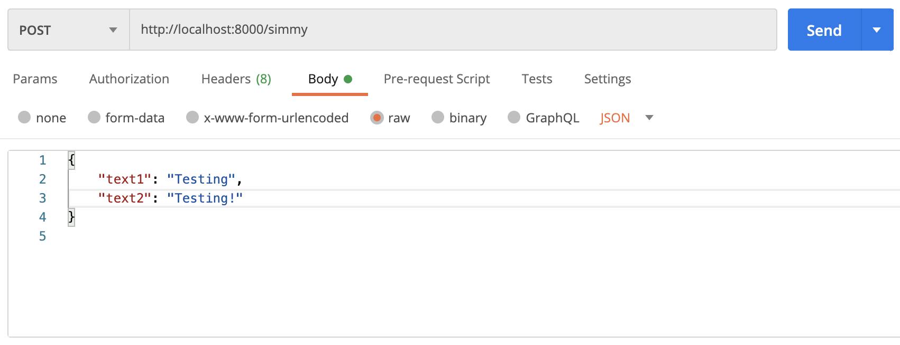

# simmy

A small web application for string similatrity comparison. The application accepts two inputs for comparison `text1` and `text2` and return a similarity ration between 1 and 0 with 1 being total similarity and 0 being no similarity.

## Dependencies

- Docker
- Docker Compose

## Install & Run Locally

- [Dependencies](#Dependencies) must first be set.
- `git clone https://github.com/jathca3/simmy.git`

### Run

- After cd'ing into the repo run `docker-compose up` to start the container.
- The app will be running at `http://localhost:8000/simmy` and accepts only POST requests.

## Use

- curl request example: `curl -H "Content-Type: application/json" -X POST -d '{"text1":"Testing","text2":"Testing!"}' http://localhost:8000/simmy`
- postman request example:

